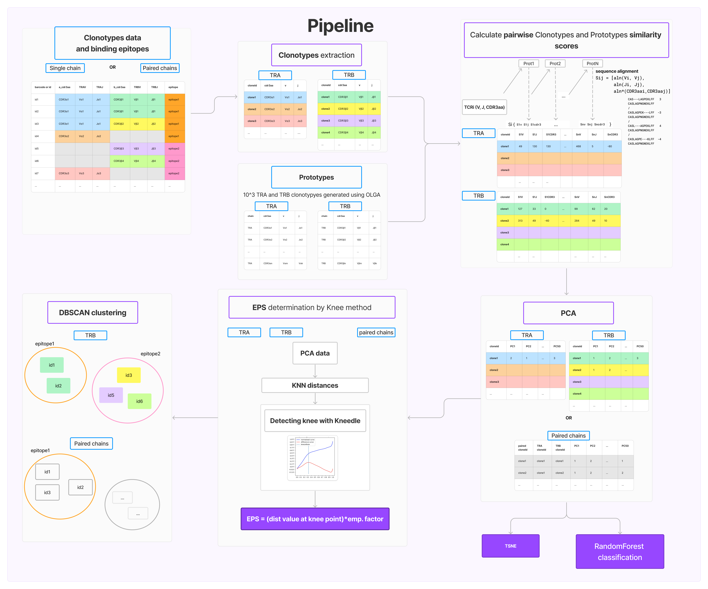

# TCRemP: T-Cell Receptor sequence embedding via Prototypes


TCRemP is a package developed to perform T-cell receptor (TCR) sequence embedding. TCR sequences encode antigen
specificity of T-cells and their repertoire obtained
using [AIRR-Seq](https://www.antibodysociety.org/the-airr-community/) family of technologies serves as a blueprint the
individual's adaptive immune system.
In general, it is very challenging to define and measure similarity between TCR sequences that will properly reflect
closeness in antigen recongition profiles. Defining a proper language model for TCRs is also a hard task due to their
immense diversity both in terms of primary sequence organization and in terms of their protein structure.
Our pipeline follows an agnostic approach and vectorizes each TCR based on its similarity to a set of ad hoc chosen
TCR "probes". Thus we follow a prototype-based approach and utilize commonly encountered TCRs either sampled from a
probabilistic V(D)J rearrangement model (see Murugan et al. 2012) or a pool of real-world TCR repertoires to construct a
coordinate system for TCR embedding.

The workflow is the following:

* TCRemP pipeline starts with a selection of ``k`` prototype TCR alpha and beta sequences, then it computes the
  distances from every of ``n`` input TCR alpha-beta pairs to ``2 * k`` prototypes for V, J and CDR3 regions, resulting
  in ``6 * k`` parameters (or ``3 * k`` for cases when only one of the chains is present).

> Distances are computed using local alignment with BLOSUM matrix, as implemented in
> our [mirpy](https://github.com/antigenomics/mirpy) package; we plan to move all computationally-intensive code there.

* Resulting distances are treated as embedding co-ordinates and and are subject to principal component analysis (PCA).
  One can monitor the information conveyed by each PC, whether they are related to features such as Variable or Joining
  genes, CDR3 region length or a certain epitope.

> N.B. TCRemP is currently in active development, please see below for the list of features, current documentation, a
> proof-of-concept example. All encountered bugs can be submitted to the ``issues`` section of the @antigenomics
> repository.

Using TCRemP one can:

- perform an embedding for a set of T-cell clonotypes, defined by TCR’s Variable (V) and Joining (J) gene IDs and
  complementarity determining region 3 (CDR3, amino acid sequence placed at the V-J junction). The embedding is
  performed by mapping those features to real vectors using similarities to a set of **prototype** TCR sequences
- embed a set of clones, pairs of TCR alpha and beta chain clonotypes
- analyze the mapping by performing dimensionality reduction and evaluating principal components (PCs)
- cluster the embeddings using [DBSCAN](https://scikit-learn.org/stable/modules/generated/sklearn.cluster.DBSCAN.html)
  method with parameter selection using knee/elbow method
- visualize T-cell clone and clonotype embeddings using tSNE, coloring the visualization by user-specified clonotype
  labels, such as antigen specificities
- infer cluster that are significantly enriched in certain labels, e.g. TCR motifs belonging to CD8+ T-cell subset or
  specific to an antigen of interest

Planned features:

- [in progress] co-embed samples with  [VDJdb database](https://github.com/antigenomics/vdjdb-db) to predict TCRs
  associated with certain antigens, i.e. “annotate” TCR repertoires
- [in progress] perform imputation to correctly handle mixed single-/paired-chain data
- [in progress] implement B-cell receptor (BCR/antibody) prototypes to apply the method to antibody sequencing data

# Getting started

## Installation procedure and first run

One can simply install the software out-of-the-box using [pip](https://pypi.org/project/pip/) with py3.11:

```{bash}
conda create -n tcremp ipython python=3.11
conda activate tcremp
pip install git+https://github.com/antigenomics/tcremp
```

Or, in case of package version problems or other issues, clone the repository manually via git, create
corresponding [conda](https://docs.conda.io/en/latest/) environment and install directly from sources:

```{bash}
git clone https://github.com/antigenomics/tcremp.git
cd tcremp
conda create -n tcremp ipython python=3.11
conda activate tcremp
pip install .
```

If the installation doesn't work for Apple M1-M3 processors install the required libraries yourself.

Check the installation by running:

```{bash}
tcremp-run -h # note that first run may be slow
cd $tcremp_repo # where $tcremp_repo is the path to cloned repository
tcremp-run -i data/example/v_tcrpmhc.txt -c TRA_TRB -o data/example/ -n 10 -x clone_id
```

check that there were no errors and observe the results stored in ``data/example`` folder. You can then go through
the ``example.ipynb`` notebook to run the analysis and visualize the results. You can proceed with your own datasets by
substituting example data with your own properly formatted clonotype tables.

## Preparing the input data

The input data typically consists of a table containing clonotypes as defined above, either TCR alpha, or beta, or both.
One can additionally tag clonotypes/clones with user-defined ids, e.g. cell barcodes, and labels, e.g. antigen
specificity or phenotype. One can also use a custom clonotype table instead of a pre-built set of prototypes (
see ``data/example/VDJdb_data_paired_example.csv``).

### Input format

#### Common requirements

1. V and J gene names should be provided based on [IMGT](https://www.imgt.org/) naming, e.g. ``TRAV35*03``
   or ``TRBV11-2``. TCRemP will always use the major allele, so the alleles above will be transformed
   into ``TRBV11-2*01``
2. The data should not contain any missing data for any of the columns: V, J and CDR3.
3. There should be no symbols except for 20 amino acids in CDR3s

#### Input columns

| Column name | Description                                                                                                    | Required                               |
|-------------|----------------------------------------------------------------------------------------------------------------|----------------------------------------|
| clone_id    | clonotype id which will be transferred to the output file and which will be used for paired chain data mapping | optional (required for `TRA_TRB` mode) |
| v_call      | TCR V gene ID                                                                                                  | required                               |
| j_call      | TCR  J gene ID                                                                                                 | required                               |
| junction_aa | TCR CDR3 amino acid sequence                                                                                   | required                               |
| locus       | either `alpha` or `beta`                                                                                       | required                               |

#### Single chain table example

Either wide with missing values

| clone_id |   junction_aa   |  v_call  | j_call  | locus |
|:--------:|:---------------:|:--------:|:-------:|:-----:|
|    1     |  CASSIRSSYEQYF  | TRBV19	  | TRBJ2-7 | beta  |
|    2     | CASSWGGGSHYGYTF | TRBV11-2 | TRBJ1-2 | beta  |

#### Paired chain example

A simple flat format

|      clone_id       |   junction_aa   |  v_call  | j_call  | locus |
|:-------------------:|:---------------:|:--------:|:-------:|:-----:|
| GACTGCGCATCGTCGG-28 |   CAGHTGNQFYF   | TRAV35	  | TRAJ49  | alpha |
| GACTGCGCATCGTCGG-28 | CASSWGGGSHYGYTF | TRBV11-2 | TRBJ1-2 | beta  |

## Running TCRemP

### Basic usage

Run the tool as

```{bash}
tcremp-run --input my_input_data.txt --output my_folder --chain TRA_TRB
```

The command above will:

- checks input data format and proofreads the dataset
- extracts TCR alpha and beta clonotypes from ``my_input_data.txt``
- calculates distance scores from clonotypes for the built-in set of ``3000`` prototypes for each chain

[//]: # (- performs **PCA** and saves transformed data)

[//]: # (- runs **DBSCAN** clustering with parameters ``min_samples = 2``, ``eps`` value inferred by knee method, and saves)

[//]: # (  resulting clusters)

[//]: # (  All input will be saved in ``my_folder/``)

### Command line parameters

The parameters for running ``tcremp-run`` main script are the following:

| parameter                  | short usage      | description                                                                    | available values                        | required | default value              |
|----------------------------|------------------|--------------------------------------------------------------------------------|-----------------------------------------|----------|----------------------------|
| --input                    | -i               | input clonotype table                                                          | path to file                            | yes      | -                          |
| --output                   | -o               | pipeline output folder                                                         | path to directory                       | no       | tcremp_{inputfilename}/    |
| --prefix                   | -e               | prefix name for distance file                                                  | str                                     | no       | tcremp_{inputfilename}/    |
| --index-col                | -x               | index column where the clonotype IDs are stored                                | str                                     | no       | tcremp_{inputfilename}/    |
| --chain                    | -c               | single or paired clonotype chains                                              | TRA, TRB, TRA_TRB                       | yes      | -                          |
| --prototypes_path          | -p               | path to the custom input prototype table                                       | path to file                            | no       | data/example/v_tcrpmhc.txt |
| --n-prototypes             | -n               | number of prototypes to be selected for embedding supplemented prototype table | integer                                 | no       | None                       |
| --sample-random-prototypes | -sample-random-p | whether to sample the prototypes randomly or not                               | bool                                    | no       | False                      |
| --n-clonotypes             | -nc              | number of clonotypes to be selected from input file                            | integer                                 | no       | None                       |
| --sample-random-clonotypes | -sample-random-c | whether to sample the clonotypes randomly or not                               | bool                                    | no       | False                      |
| --species                  | -s               | species of built-in prototypes to be used                                      | HomoSapiens, MusMusculus, MacacaMulatta | no       | HomoSapiens                |
| --random-seed              | -r               | random seed for random prototype selection                                     | integer                                 | no       | None                       |
| --nproc                    | -np              | number of processes to perform calculcation with                               | integer                                 | no       | 1                          |
| --lower-len-cdr3           | -llen            | filter out cdr3 with len <llen                                                 | integer                                 | no       | 30                         |
| --higher-len-cdr3          | -hlen            | filter out cdr3 with len >hlen                                                 | integer                                 | no       | 30                         |
| --metrics                  | -m               | which type of matrics to use: similarity or dissimilarity one                  | similarity, dissimilarity               | no       | similarity                 |

### Output

The output file will contain the following **columns**:

- clone_id - assigned identifier to each row of the input table (either tranferred from initial data or generated)
- {i}_a_v, {i}_a_j, {i}_a_cdr3 - columns with distances to each alpha prototype
- {i}_b_v, {i}_b_j, {i}_b_cdr3 - columns with distances to each beta prototype

Each line of the output file corresponds to one input clonotype.