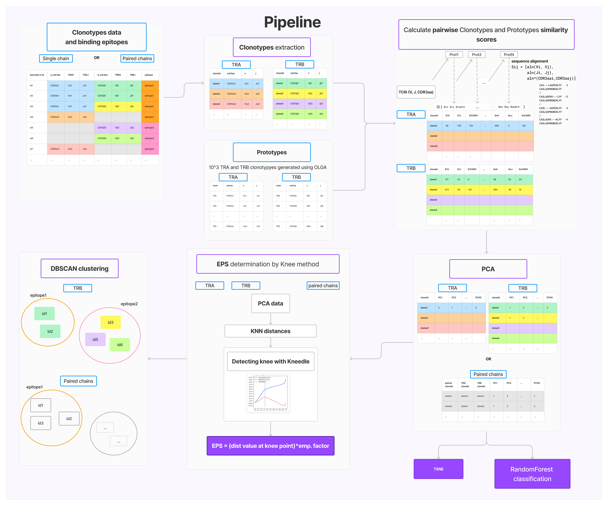
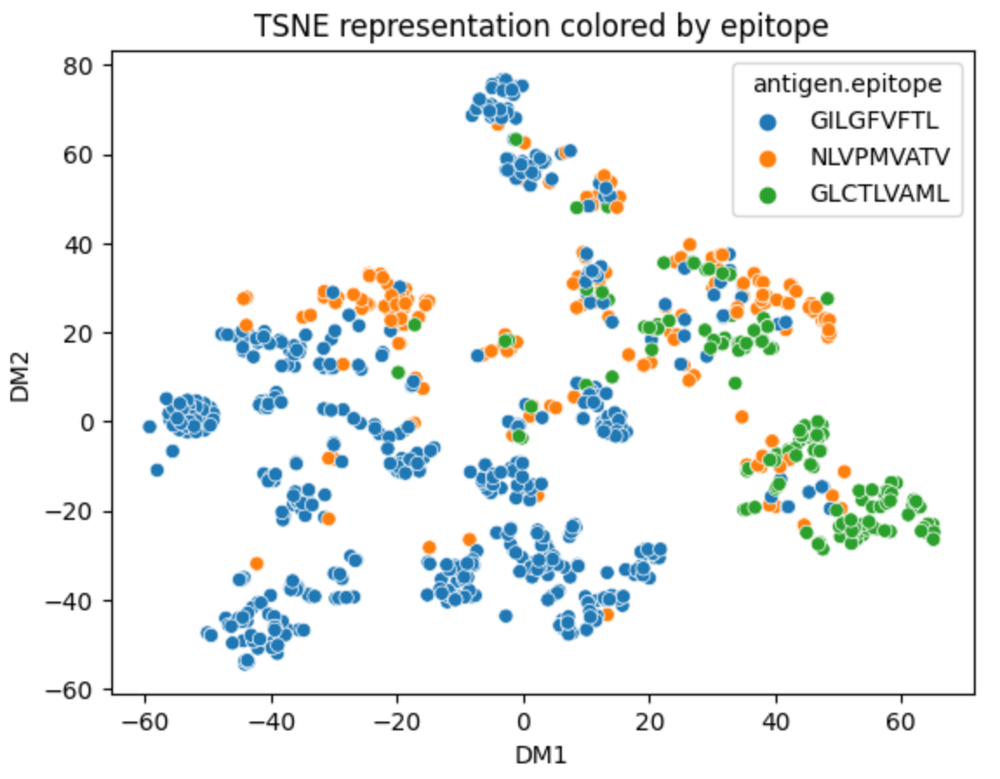
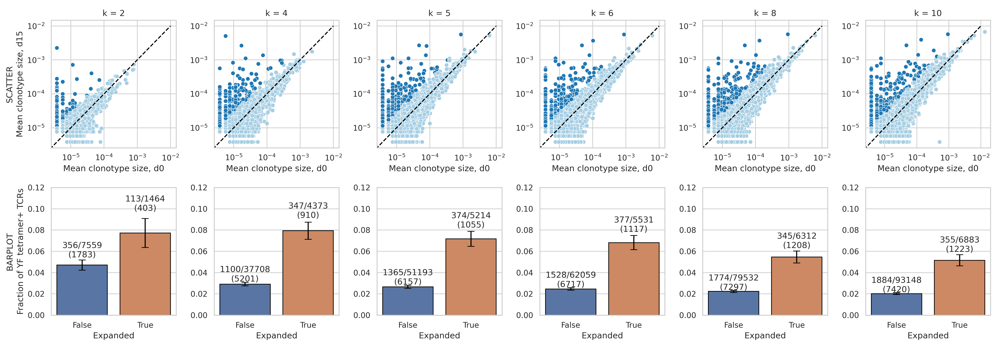
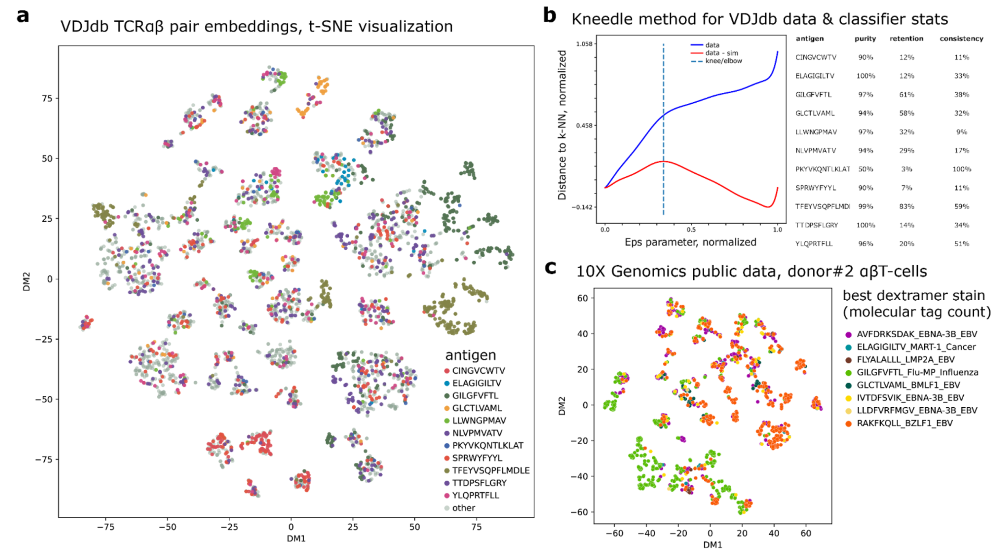

# TCRemP: T-Cell Receptor sequence embedding via Prototypes


TCRemP is a package developed to perform T-cell receptor (TCR) sequence embedding. TCR sequences encode antigen
specificity of T-cells and their repertoire obtained using [AIRR-Seq](https://www.antibodysociety.org/the-airr-community/) family of technologies serves as a blueprint the individual's adaptive immune system.
In general, it is very challenging to define and measure similarity between TCR sequences that will properly reflect
closeness in antigen recongition profiles. Defining a proper language model for TCRs is also a hard task due to their
immense diversity both in terms of primary sequence organization and in terms of their protein structure.
Our pipeline follows an agnostic approach and vectorizes each TCR based on its similarity to a set of ad hoc chosen
TCR "probes". Thus we follow a prototype-based approach and utilize commonly encountered TCRs either sampled from a
probabilistic V(D)J rearrangement model (see Murugan et al. 2012) or a pool of real-world TCR repertoires to construct a
coordinate system for TCR embedding.

The workflow is the following:

* TCRemP pipeline starts with a selection of ``k`` prototype TCR alpha and beta sequences, then it computes the
  distances from every of ``n`` input TCR alpha-beta pairs to ``2 * k`` prototypes for V, J and CDR3 regions, resulting
  in ``6 * k`` parameters (or ``3 * k`` for cases when only one of the chains is present).

> Distances are computed using local alignment with BLOSUM matrix, as implemented in
> our [mirpy](https://github.com/antigenomics/mirpy) package; we plan to move all computationally-intensive code there.

* Resulting distances are treated as embedding co-ordinates and and are subject to principal component analysis (PCA).
  One can monitor the information conveyed by each PC, whether they are related to features such as Variable or Joining
  genes, CDR3 region length or a certain epitope.

> N.B. TCRemP is currently in active development, please see below for the list of features, current documentation, a
> proof-of-concept example. All encountered bugs can be submitted to the ``issues`` section of the @antigenomics
> repository.

Using TCRemP one can:

- perform an embedding for a set of T-cell clonotypes, defined by TCR’s Variable (V) and Joining (J) gene IDs and
  complementarity determining region 3 (CDR3, amino acid sequence placed at the V-J junction). The embedding is
  performed by mapping those features to real vectors using similarities to a set of **prototype** TCR sequences
- embed a set of clones, pairs of TCR alpha and beta chain clonotypes
- analyze the mapping by performing dimensionality reduction and evaluating principal components (PCs)
- cluster the embeddings using [DBSCAN](https://scikit-learn.org/stable/modules/generated/sklearn.cluster.DBSCAN.html)
  method with parameter selection using knee/elbow method
- visualize T-cell clone and clonotype embeddings using tSNE, coloring the visualization by user-specified clonotype
  labels, such as antigen specificities
- infer cluster that are significantly enriched in certain labels, e.g. TCR motifs belonging to CD8+ T-cell subset or
  specific to an antigen of interest

Planned features:

- [in progress] co-embed samples with  [VDJdb database](https://github.com/antigenomics/vdjdb-db) to predict TCRs
  associated with certain antigens, i.e. “annotate” TCR repertoires
- [in progress] perform imputation to correctly handle mixed single-/paired-chain data
- [in progress] implement B-cell receptor (BCR/antibody) prototypes to apply the method to antibody sequencing data

## Citing

Please cite the tool using the paper: 

`Yulia Kremlyakova, Elizaveta Vlasova, Daniil Luppov, Mikhail Shugay, TCREMP: a bioinformatic pipeline for efficient embedding of T-cell receptor sequences from immune repertoire and single-cell sequencing data, Journal of Molecular Biology, 2025`

(https://doi.org/10.1016/j.jmb.2025.169205)

# Getting started

## Installation procedure and first run

One can simply install the software out-of-the-box using [pip](https://pypi.org/project/pip/) with py3.11:

```{bash}
conda create -n tcremp ipython python=3.11
conda activate tcremp
pip install git+https://github.com/antigenomics/tcremp@0.0.1-publication
```

> `0.0.1-publication` tag corresponds to the version used in the publication *TCREMP, JMB, 2025*.  
>
> For the latest version install via the following command: `pip install git+https://github.com/antigenomics/tcremp`

Or, in case of package version problems or other issues, clone the repository manually via git, create
corresponding [conda](https://docs.conda.io/en/latest/) environment and install directly from sources:

```{bash}
git clone https://github.com/antigenomics/tcremp.git
cd tcremp
conda create -n tcremp ipython python=3.11
conda activate tcremp
pip install .
```

If the installation doesn't work for Apple M1-M3 processors install the required libraries yourself.

Check the installation by running:

```{bash}
tcremp-run -h # note that first run may be slow
cd $tcremp_repo # where $tcremp_repo is the path to cloned repository
tcremp-run -i data/example/v_tcrpmhc.txt -c TRA_TRB -o data/example/ -n 10 -x clone_id
```

check that there were no errors and observe the results stored in ``data/example`` folder. You can then go through
the ``example.ipynb`` notebook to run the analysis and visualize the results. You can proceed with your own datasets by
substituting example data with your own properly formatted clonotype tables.

## Preparing the input data

The input data typically consists of a table containing clonotypes as defined above, either TCR alpha, or beta, or both.
One can additionally tag clonotypes/clones with user-defined ids, e.g. cell barcodes, and labels, e.g. antigen
specificity or phenotype. One can also use a custom clonotype table instead of a pre-built set of prototypes (
see ``data/example/VDJdb_data_paired_example.csv``).

### Input format

#### Common requirements

1. V and J gene names should be provided based on [IMGT](https://www.imgt.org/) naming, e.g. ``TRAV35*03``
   or ``TRBV11-2``. TCRemP will always use the major allele, so the alleles above will be transformed
   into ``TRBV11-2*01``
2. The data should not contain any missing data for any of the columns: V, J and CDR3.
3. There should be no symbols except for 20 amino acids in CDR3s

#### Input columns

| Column name | Description                                                                                                    | Required                               |
|-------------|----------------------------------------------------------------------------------------------------------------|----------------------------------------|
| clone_id    | clonotype id which will be transferred to the output file and which will be used for paired chain data mapping | optional (required for `TRA_TRB` mode) |
| v_call      | TCR V gene ID                                                                                                  | required                               |
| j_call      | TCR  J gene ID                                                                                                 | required                               |
| junction_aa | TCR CDR3 amino acid sequence                                                                                   | required                               |
| locus       | either `alpha` or `beta`                                                                                       | required                               |

#### Single chain table example

Simple long-format table without missing values

| clone_id |   junction_aa   |  v_call  | j_call  | locus |
|:--------:|:---------------:|:--------:|:-------:|:-----:|
|    1     |  CASSIRSSYEQYF  | TRBV19	  | TRBJ2-7 | beta  |
|    2     | CASSWGGGSHYGYTF | TRBV11-2 | TRBJ1-2 | beta  |

#### Paired chain example

A simple flat format

|      clone_id       |   junction_aa   |  v_call  | j_call  | locus |
|:-------------------:|:---------------:|:--------:|:-------:|:-----:|
| GACTGCGCATCGTCGG-28 |   CAGHTGNQFYF   | TRAV35	  | TRAJ49  | alpha |
| GACTGCGCATCGTCGG-28 | CASSWGGGSHYGYTF | TRBV11-2 | TRBJ1-2 | beta  |

## Running TCRemP

### Basic usage of TCREmP

Run the main pipeline as

```{bash}
tcremp-run --input my_input_data.txt --output my_folder --chain TRA_TRB
```

The command above performs the following stages:

1. Reads the input table and optionally removes fully duplicated rows when `--unique-clonotypes` is enabled.
2. Resolves the prototype table either from `--prototypes-path` or from built-in resources for the selected chain mode.
3. Loads clonotypes into MIR objects and filters them by CDR3 length using `lower_len_cdr3 <= len(CDR3) < higher_len_cdr3`.
4. Optionally subsamples clonotypes and prototypes.
5. Writes `*_tcremp_representations.tsv` with clonotype metadata.
6. Computes prototype-based embedding distances.
7. Unless `--skip-clustering` is passed, runs standardization, PCA and DBSCAN clustering with automatic `eps` estimation by the knee method.
8. Optionally computes cluster enrichment if `--enrich-by` is specified.
9. Optionally computes PCA and t-SNE outputs if `--tsne` is specified.
10. Saves embeddings to `*_tcremp.parquet` unless `--no-save-dists` is passed.

Built-in chain modes supported by `tcremp-run`:

- single-chain: `TRA`, `TRB`, `TRG`, `TRD`, `IGH`, `IGK`, `IGL`
- paired-chain: `TRA_TRB`, `TRG_TRD`, `IGH_IGL`, `IGH_IGK`

Built-in prototype tables contain 3000 entries per single chain. For paired-chain modes, TCRemP assembles a temporary paired prototype table from the corresponding per-chain built-in resources.

### Command line parameters for `tcremp-run`

| parameter | short usage | description | available values | required | default value |
| --------- | ----------- | ----------- | ---------------- | -------- | ------------- |
| --input | -i | input clonotype table | path to file | yes | - |
| --output | -o | pipeline output folder | path to directory | yes | - |
| --prefix | -e | output prefix | str | no | stem of `--input` |
| --index-col | -x | column with clonotype IDs transferred to outputs | str | no | None |
| --labels-col | -l | metadata column used for t-SNE coloring | str | no | None |
| --enrich-by | - | metadata column used for cluster enrichment analysis | str | no | None |
| --chain | -c | single- or paired-chain mode | `TRA`, `TRB`, `TRG`, `TRD`, `IGH`, `IGK`, `IGL`, `TRA_TRB`, `TRG_TRD`, `IGH_IGL`, `IGH_IGK` | yes | - |
| --prototypes-path | -p | custom prototype table; if omitted, built-in resources are used | path to file | no | built-in table resolved from `--chain` |
| --n-prototypes | -n | number of prototypes to use | integer | no | all selected prototypes |
| --sample-random-prototypes | -sample_random_p | sample prototypes randomly instead of taking the first `n` | flag | no | False |
| --n-clonotypes | -nc | number of clonotypes/clones to process | integer | no | all clonotypes |
| --sample-random-clonotypes | -sample_random_c | sample clonotypes randomly instead of taking the first `n` | flag | no | False |
| --species | -s | species used for V/J gene alignment | `HomoSapiens`, `MusMusculus`, `MacacaMulatta` | no | `HomoSapiens` |
| --unique-clonotypes | -u | remove fully duplicated input rows before parsing | flag | no | False |
| --random-seed | -r | random seed for sampling and stochastic procedures | integer | no | 42 |
| --nproc | -np | number of worker processes/threads for embeddings | integer | no | auto: `min(8, cpu_count)` |
| --lower-len-cdr3 | -llen | keep only clonotypes with `len(CDR3) >= lower-len-cdr3` | integer | no | 5 |
| --higher-len-cdr3 | -hlen | keep only clonotypes with `len(CDR3) < higher-len-cdr3` | integer | no | 30 |
| --metrics | -m | score type used for embedding | `similarity`, `dissimilarity` | no | `dissimilarity` |
| --save-dists | -d | keep saving the embedding parquet; enabled by default | flag | no | True |
| --no-save-dists | - | disable saving the embedding parquet | flag | no | False |
| --skip-clustering | - | skip DBSCAN clustering | flag | no | False |
| --cluster-pc-components | -npc | PCA components used before clustering and for PCA/t-SNE preprocessing | integer | no | 50 |
| --cluster-min-samples | -ms | `min_samples` for DBSCAN in the main pipeline | integer | no | 3 |
| --k-neighbors | -kn | k-th neighbor used for knee-based `eps` estimation in the main pipeline | integer | no | 4 |
| --tsne | - | run PCA+t-SNE visualization and save coordinates | flag | no | False |
| --tsne-init | - | t-SNE initialization | `pca`, `random` | no | `pca` |
| --tsne-perplexity | - | t-SNE perplexity | float | no | 15 |
| --enrichment-threshold | - | advisory within-cluster label fraction threshold | float | no | 0.7 |
| --enrichment-fdr-threshold | - | FDR threshold for enrichment calls | float | no | 0.05 |

Notes:

- `clone_id` is included in `*_tcremp.parquet` only if `--index-col` is provided.
- Metadata propagation for `--labels-col` and `--enrich-by` also requires `--index-col`; otherwise TCRemP logs a warning and skips metadata transfer.
- `--save-dists` is enabled by default in the parser; use `--no-save-dists` to suppress parquet output.

### Separate `tcremp-cluster` launch

If you already have a numeric embedding table, you can run clustering separately:

```{bash}
tcremp-cluster --input tcremp_distances.tsv --output tcremp_clusters.tsv --components 50 --min_samples 5 --kth_neighbor 4
```

Command line parameters for `tcremp-cluster`:

| parameter | description | required | default value |
| --------- | ----------- | -------- | ------------- |
| --input | path to a TSV file with numeric features | yes | - |
| --output | path to save clustering results | yes | - |
| --components | number of PCA components | no | 50 |
| --min_samples | `min_samples` parameter for DBSCAN | no | 5 |
| --kth_neighbor | k-th neighbor used for knee-based `eps` estimation | no | 4 |

The standalone clustering command appends a `cluster` column to the input table. This differs from the main `tcremp-run` pipeline, which writes `cluster_id`.

### Separate `tcremp-enrich` launch

If clustering has already been computed, enrichment can be run separately:

```{bash}
tcremp-enrich --input my_clusters.tsv --output enrich_out -e my_run --label-col phenotype
```

Command line parameters for `tcremp-enrich`:

| parameter | short usage | description | required | default value |
| --------- | ----------- | ----------- | -------- | ------------- |
| --input | -i | clustered input table | yes | - |
| --output | -o | output folder | yes | - |
| --prefix | -e | output prefix | no | stem of `--input` |
| --label-col | -l | column used for enrichment analysis | yes | - |
| --cluster-col | - | cluster column name | no | `cluster_id` |
| --enrichment-threshold | - | advisory within-cluster label fraction threshold | no | 0.7 |
| --enrichment-fdr-threshold | - | FDR threshold used for enrichment calls | no | 0.05 |

### Output files

Files produced by `tcremp-run` depend on the selected flags:

- `*_tcremp_representations.tsv`: always written; contains `clone_id`, chain annotations (`cdr3aa_*`, `v_*`, `j_*`) and transferred metadata columns when available.
- `*_tcremp.parquet`: written unless `--no-save-dists` is passed; contains the embedding distance matrix.
- `*_tcremp_clusters.tsv`: written unless `--skip-clustering` is passed; contains `cluster_id` plus all representation columns.
- `*_tcremp_enrichment_summary.tsv`: written only when clustering is performed and `--enrich-by` is provided.
- `*_tcremp_clusters_enriched.tsv`: written only when clustering is performed and `--enrich-by` is provided.
- `*_tcremp_pca.tsv`: written only when `--tsne` is provided.
- `*_tcremp_tsne.tsv`: written only when `--tsne` is provided.
- `*_tcremp_tsne.png`: written only when both `--tsne` and `--labels-col` are provided.
- `*.log`: run log written under the selected output prefix.

TCRemP explicitly logs input deduplication and CDR3 length filtering. For filtering, the log records the bounds used together with the numbers of clonotypes kept and removed because they were too short or too long.

## Usage examples

### VDJdb example

Basic example of TCRemP usage is running it for VDJdb subsets. The input data for this example can be found in `data/example`. The derived embeddings were further visualized using PCA into 50 components and TSNE. The clonotypes are colored by the epitope. 



### Yellow Fever Vaccination example 

Another example we introduce is the yellow fever vaccination clusters analysis. We merged the day 0 and day 15 datasets and ran TCRemP for the merged set of clonotypes. The clonotypes were further clustered and the enrichment score of each cluster on day 15 was calculated. For more details refer to the initial manuscript.

Various parameters of k - rank of nearest neighbor for DBScan epsilon estimation. The results show that k=4 is the optimal parameter.



 

### 10X data example

We also performed an analysis of the embeddings derived from patient 10X data. For more information on this example refer to the manuscript Figure 2.



